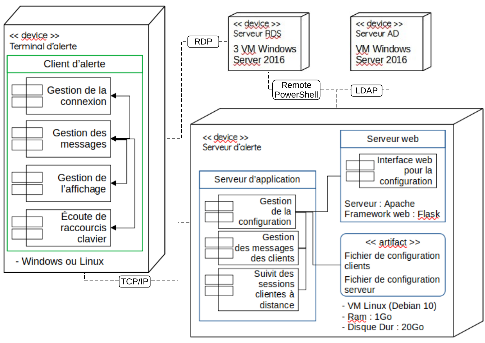
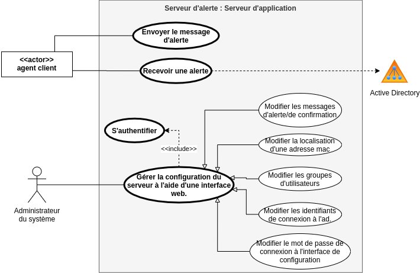

# Kemenn Server

The server for Kemenn project.

This server allows to manage the client connections and their configurations in a centralized way. A simple web interface is proposed.

This is the technical documentation. You can find the users documentation here : https://github.com/Kemenn/presentation.git

- [DESCRIPTION](#description)
- [INSTALLATION](#installation)
- [CONFIGURATION](#configuration)
- [TODO TASKS](#todo-tasks)


## Description

The server is made in 3 parts:

 * **The configuration manager** : it is in charge of reading the configuration and looking for the necessary information to send messages to the clients.

 * **The message handler** : it processes incoming messages and replies to them.

 * **The session manager** : it keeps an updated list of the current sessions of the rds servers. It also keeps the list of correspondence between mac address and username of all clients (thin client or thick client).

 * **The web interface** : is managed by apache.


### Deployement diagram



### Use case diagram



### Syntax of outgoing messages :
```
r[] '' → message reçus (Read)
s[] '' → message envoyé (Send)
m[] '' → Message d'information du serveur
a[] '' → message envoyé pour Action
```


## Installation

The installation is done in two steps: creating a debian package, then installing it.

**Python dependancy :**
`ast, configparser, datetime, flask, getmac, hashlib, ldap, os, pypsrp, random, re, select, socket, sys, threading, time`


### Linux (debian based) :

- Download and create the debian package :

```
apt install -y git
git clone https://github.com/Kemenn/srv-kemenn.git
cd srv-kemenn/
chmod +x srv-kemenn_to_deb.sh
./srv-kemenn_to_deb.sh
```
- Install the package on your system :

```
apt install -y ./srv-kemenn.deb
```
*Note* : Installation tested only on debian. It should not be a problem on a derived system. On the other hand for the other linux some modifications may be necessary.


### Windows :
I have no time. Install Linux and refer to the previous step...

## Configuration

There is 3 configurations files in */etc/kemenn* directory :

 * **kemenn** : The configuration need a restart of service.
  * HOST : the ip or hostname used by kemenn service.
  * PORT : the port used by kemenn service.
  * SEARCH_MAC _RDP _CLIENTS : if you use rds system, set this value to True.
  * MAC _SERVICE _TIME : time between two scan of session on rds servers.
  * USE _LDAP _SERVICE : set this value to True if you want to use an ldap directory to found firstname and lastname of users.

 * **clt-kemenn** : The informations used to display message on client.
  * Message (alert, confirm, error) : You can set the message display in graphical window by type.
  * Groups : To set groups of users.
  * Location : To set the correspondance between a mac with a human location. When a users connect with a computer for the first time, a localisation name is asked and save in this part.
  * Contact : To set the correspondance between a username with the humans name of a person when not in ldap.

 * **srv-kemenn** : The informations used by server service.
  * password : the hash of password used for access configuration webpage.
  * Ldap (adress or ip, username, password, base) : the necessary informations to use an ldap services. Users can be a simple user without admin rights.
  * Rds (adress or ip list, username, password) : the necessary informations needed to keep the list of current rds server sessions up to date.


### Syntax of the client configuration file :

 - **Groups** : no space before or after the commas that separate the usernames composing the group.
 `groupname = user1,user2,etc...`

 - **Locations** : mac address in lower case without the separation by ":".
 `mac_adress = localisation`

 - **Messages configuration** : The following variables will be replaced by the information of the person from whom the message comes.
  - $FIRSTNAME : replace by firstname
  - $LASTNAME : replace by lasttname
  - $LOCATION : replace by location


## Todo Tasks

 - Send another message when there is no receivers of the alert.

 - Allow possibility to send message to a specific client by command interface.
 
 - Remake the indexation of current session of rds...